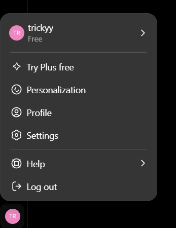
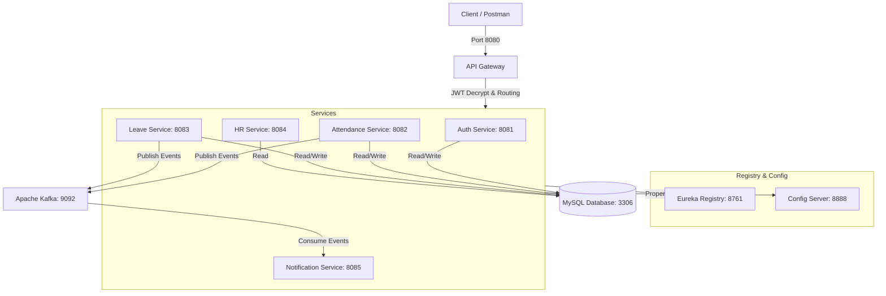

# TechNova Leave & Attendance Management Portal

An enterprise-grade, microservices-based portal designed for **TechNova Pvt. Ltd.** to automate and manage employee check-ins, check-outs, late arrival flaggings, and multi-tier leave approval workflows for over 2,500+ employees. 

This system reduces payroll/attendance reconciliation time from **7 days to under 1 day**.

---

## 1. System Architecture

The portal is designed as a distributed microservice system where all requests flow through an API Gateway, authenticated using JWT tokens, and business events are published asynchronously to an Apache Kafka queue.





---

## 2. Technology Stack

* **Core Backend:** Java 21, Spring Boot 3.4.x, Spring Data JPA
* **Service Coordination:** Spring Cloud Config Server, Netflix Eureka Discovery Client
* **Routing & Security:** Spring Cloud Gateway Server (WebMVC-based), Spring Security with JWT (java-jwt)
* **Messaging Bus:** Apache Kafka (Producer/Consumer template)
* **Database:** MySQL 8.x (Single shared database instance, separate tables per microservice context)
* **Validation:** Jakarta Bean Validation (Spring Boot Starter Validation)

---

## 3. Microservice Module Directory & Ports

| Service Module | Port | Key Responsibilities |
| :--- | :--- | :--- |
| `config-server` | `8888` | Serves properties configurations dynamically from the `config-repo` folder. |
| `eureka-server` | `8761` | Microservice directory register. Dashboard is hosted here. |
| `api-gateway` | `8080` | Handles routing, path-matching, CORS, and decrypts JWT to inject user context headers (`X-User-Id`, `X-User-Role`, etc.). |
| `auth-service` | `8081` | Handles email-based user registration, login, token generation, and administrator approvals. |
| `attendance-service` | `8082` | Handles employee Check-In (with late arrival rules) and Check-Out (working hours calculations). |
| `leave-service` | `8083` | Handles leave balance allocations, leave submissions, business-day calculations, and manager/HR approval pipelines. |
| `hr-service` | `8084` | Generates system-wide analytics reports for HR admins. |
| `notification-service` | `8085` | Consumes check-in, check-out, and leave events from Kafka to dispatch notifications. |

---

## 4. Application Functionalities

### 4.1 Authentication & Security (Auth Service)
* **Email-Based Logins:** Users authenticate using their email and password instead of usernames.
* **Security Control:** Enforces hashed passwords storage via BCrypt. 
* **Role Hierarchy:** Enforces roles: `EMPLOYEE`, `MANAGER`, `HR`, and `ADMIN`.

### 4.2 Attendance Tracking (Attendance Service)
* **Check-In/Check-Out:** Employees register their daily work shifts.
* **Duplicate Prevention:** Prevents employees from checking in or checking out multiple times on the same day.
* **Late Detection:** Automatically flags check-ins after `09:15 AM` as `late: true` and logs it in MySQL.
* **Work Duration Tracker:** At check-out, calculates the shift duration in hours (rounded to 2 decimal places) and updates the record.

### 4.3 Leaves Management (Leave Service)
* **Accrued Balances:** Allocates distinct starting balances for Casual (10), Medical (15), and Paid (20) leaves.
* **Leave Requests:** Employees submit leaves specifying start date, end date, leave type, and manager.
* **Leave Balances Check:** Verifies sufficient balance prior to submitting the leave request.
* **Cancellation:** Employees can cancel their own pending/approved leave requests, which automatically restores their leave credits.

### 4.4 Multi-Tier Approvals & Escalations
* **No Self-Approval:** Prevents managers or HR from approving or rejecting their own leave requests.
* **Manager Approval:** Managers review pending requests for employees reporting to them (duration <= 10 days are approved directly).
* **HR Validation:** Leaves exceeding **10 days** are automatically escalated to status `PENDING_HR` and require HR validation.
* **Aging Escalation Engine:** A scheduler scans for requests pending with managers for >2 days and automatically escalates them to HR.

### 4.5 Analytical Reporting (HR Service)
* Provides HR administrators with aggregate metrics:
  * Total Headcount (registered employees).
  * Checked-In count today.
  * Late arrivals count today.
  * Active approved leaves count today.

### 4.6 Telemetry & Live Logs (Notification Service)
* Listens to check-in, check-out, and leave application events broadcast over Kafka and logs them in real-time.

---

## 5. What We Have Accomplished (Session Log)

Here is a summary of the engineering fixes, upgrades, and refactoring completed:

1. **Database Consolidation (MySQL Migration):**
   * Removed all embedded/in-memory databases (H2, Derby).
   * Configured all services to write to a centralized MySQL instance on port `3306` with database `leave_mgmt` created automatically.
2. **Kafka template Configuration Fix:**
   * Resolved a critical startup crash in `attendance-service` where `KafkaTemplate` could not be autowired. Added proper serialization/deserialization beans.
3. **API Gateway MVC Refactoring:**
   * Added the missing `spring-cloud-starter-config` and `spring-cloud-starter-loadbalancer` dependencies to `api-gateway` to allow `lb://` service name resolutions.
   * Fixed the configuration property routes prefix, changing it to the WebMVC-compliant `spring.cloud.gateway.server.webmvc.routes` namespace.
   * Moved all gateway routes locally to the Gateway resources folder to prevent boot race-conditions with the Config Server.
4. **Transition to Email-Based Authentication:**
   * Altered the database schema in `User.java` to make `email` unique and `username` non-unique.
   * Updated the login DTO and service layers to authenticate users using `email` and `password`.
5. **Jakarta DTO Validations:**
   * Added `spring-boot-starter-validation` to the parent POM.
   * Applied `@NotBlank`, `@Email`, and `@NotNull` validation annotations to DTO models to handle parameters verification at the controller entrance rather than manual code checks.
6. **Admin Registration Approval System:**
   * All registered users default to `approved = false` and cannot log in.
   * Hardcoded dynamic Admin credentials (`admin@technova.com` / `admin123`) which generate valid JWTs.
   * Added `POST /api/auth/approve/{userId}` endpoint, accessible only by `ADMIN` role, to activate user accounts.
7. **Advanced Leave Business Logic:**
   * **Weekend Exclusion:** Created a business-day calculator that excludes Saturdays and Sundays from leave deductions.
   * **Anti-Loophole Medical Leaves:** Implemented contiguous date range checking. If an employee tries to chain multiple back-to-back medical leave requests to bypass the 3-day certificate rule, the system detects it and blocks submission unless a certificate is uploaded.

---

## 6. Setup and Execution

### 6.1 Compilation & Packaging
Build all microservices JAR binaries from the root folder:
```bash
mvn clean package -DskipTests
```

### 6.2 Starting Services
Use the automated PowerShell startup script:
```powershell
./start-services.ps1
```

### 6.3 Postman Testing
Import **`postman_collection.json`** into Postman. Follow the chronological order of requests to register, approve, login, check-in/out, and apply for leaves.

*Detailed endpoints instructions are available in the **[RUNBOOK.md](RUNBOOK.md)** file.*
